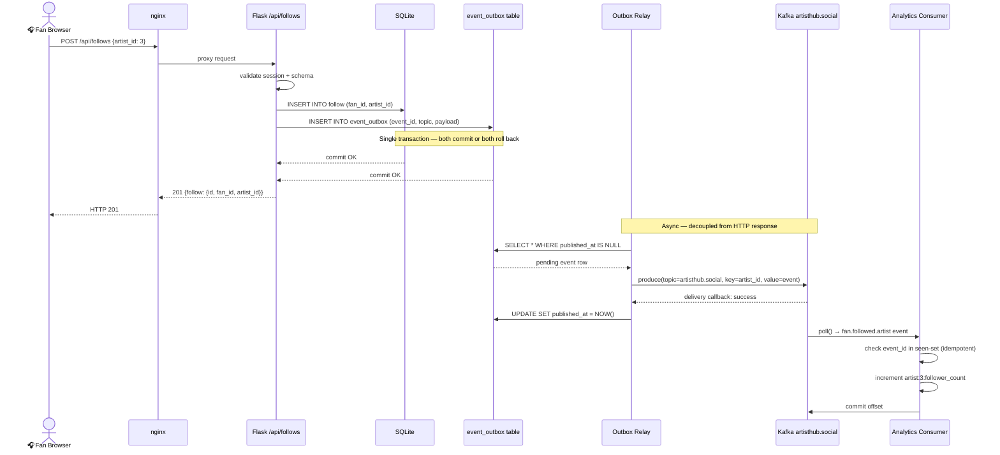
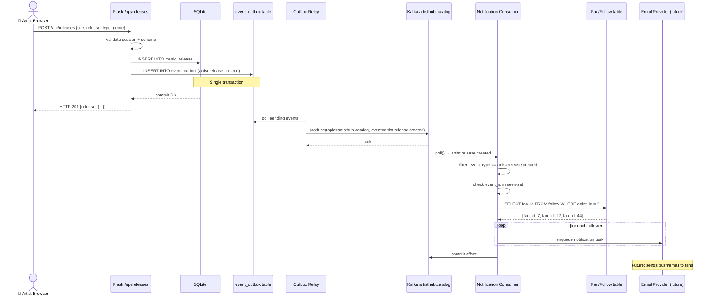

# Phase 7 — Confluent / Apache Kafka Event-Driven Architecture

> **DESIGN ONLY — no code has been written or modified.**
> All implementation sub-phases require explicit approval before a single line changes.

---

## Overview

ArtistHub v0.1.0 is a synchronous request/response platform: every action produces only
a database write and an HTTP response. Nothing else knows a follow happened, a release
dropped, or a post went live until someone polls the REST API.

This design evolves ArtistHub into an **event-driven platform** by inserting a Kafka
producer after each `db.session.commit()` in the six mutating route modules. Downstream
consumers — analytics, notifications, recommendations — react to events without
coupling to or querying the Flask application.

**The Flask REST API, its contract, and its database schema are unchanged.**
Kafka is additive infrastructure, not a rewrite.

---

## 1 — Business Events Inventory

Each row maps one ArtistHub user action to a Kafka event.

| Business Action | Why Consumers Care | Producing Route | Event Name | Topic |
|---|---|---|---|---|
| Fan follows artist | Follower count, recommendations, milestone alerts | `POST /api/follows` → `follows.py:100` | `fan.followed.artist` | `artisthub.social` |
| Fan unfollows artist | Follower count correction, churn detection | `DELETE /api/follows/<id>` → `follows.py:140` | `fan.unfollowed.artist` | `artisthub.social` |
| Artist created release | Fan notifications, genre analytics, search index | `POST /api/releases` → `releases.py:164` | `artist.release.created` | `artisthub.catalog` |
| Artist updated release | Search index refresh, cached data invalidation | `PUT /api/releases/<id>` → `releases.py:223` | `artist.release.updated` | `artisthub.catalog` |
| Artist deleted release | Search index cleanup, analytics correction | `DELETE /api/releases/<id>` → `releases.py:254` | `artist.release.deleted` | `artisthub.catalog` |
| Artist created post | Fan feed refresh, engagement analytics | `POST /api/posts` → `posts.py:141` | `artist.post.created` | `artisthub.social` |
| Artist deleted post | Feed cache invalidation | `DELETE /api/posts/<id>` → `posts.py:172` | `artist.post.deleted` | `artisthub.social` |
| Artist created merch | Catalogue analytics, fan shopping alerts | `POST /api/merch` → `merch.py:150` | `artist.merch.created` | `artisthub.catalog` |
| Artist updated merch | Inventory tracking, price change alerts | `PUT /api/merch/<id>` → `merch.py:206` | `artist.merch.updated` | `artisthub.catalog` |
| Artist deleted merch | Catalogue cleanup | `DELETE /api/merch/<id>` → `merch.py:237` | `artist.merch.deleted` | `artisthub.catalog` |
| Artist registered | Onboarding workflow trigger | `POST /api/auth/artist/register` → `auth.py:115` | `artist.registered` | `artisthub.identity` |
| Artist updated profile | Search index refresh, analytics | `PUT /api/artists/<id>` | `artist.profile.updated` | `artisthub.identity` |

---

## 2 — Kafka Topic Architecture

### Topic-per-domain vs topic-per-event-type

**Topic-per-event-type** (e.g. `artisthub.follow.created`, `artisthub.release.created`)
- Pro: each consumer subscribes only to exactly what it needs.
- Con: ArtistHub has 12 event types today; that grows to 20+ quickly. Consumer code
  accumulates a list of `subscribe([topic1, topic2, …])` calls. Schema Registry subjects
  multiply. Operational overhead scales linearly with event count.

**Topic-per-domain** (e.g. `artisthub.social`, `artisthub.catalog`, `artisthub.identity`)
- Pro: consumers subscribe to a domain and filter on `event_type` in the envelope.
  New event types in a domain require no infrastructure change.
- Con: a consumer interested only in `artist.release.created` still reads all catalog
  events. For high-volume topics this wastes I/O; for ArtistHub MVP volumes it is
  negligible.

**Recommendation: topic-per-domain.** ArtistHub is an MVP. Three topics cover all
12 events. Splitting prematurely creates operational complexity with no benefit at
current scale. The `event_type` field in every message envelope is the discriminator.

### Topic Definitions

#### `artisthub.social`
| Attribute | Value |
|---|---|
| **Event types** | `fan.followed.artist`, `fan.unfollowed.artist`, `artist.post.created`, `artist.post.deleted` |
| **Message key** | `artist_id` — keeps all events for one artist on the same partition, preserving order per artist |
| **Partitions** | 6 (allows 6 parallel consumers; re-partition when > 10 k events/minute) |
| **Retention** | 7 days — social events age out quickly; analytics consumers checkpoint regularly |
| **Producers** | Flask `follows_bp`, `posts_bp` |
| **Consumers** | Analytics service (follower counts, post engagement), Notification service (post alerts), Recommendation engine (fan interest graph) |

#### `artisthub.catalog`
| Attribute | Value |
|---|---|
| **Event types** | `artist.release.created`, `artist.release.updated`, `artist.release.deleted`, `artist.merch.created`, `artist.merch.updated`, `artist.merch.deleted` |
| **Message key** | `artist_id` — keeps an artist's catalog events ordered |
| **Partitions** | 6 |
| **Retention** | 30 days — catalog events need longer window for rebuilding derived read models |
| **Producers** | Flask `releases_bp`, `merch_bp` |
| **Consumers** | Analytics service (catalog counts), Notification service (new release alerts), Search indexer (future), Recommendation engine |

#### `artisthub.identity`
| Attribute | Value |
|---|---|
| **Event types** | `artist.registered`, `artist.profile.updated` |
| **Message key** | `artist_id` |
| **Partitions** | 3 — lowest volume topic |
| **Retention** | 90 days — identity events are low volume and useful for onboarding audit |
| **Producers** | Flask `auth_bp`, `artists_bp` |
| **Consumers** | Onboarding workflow (welcome email), Search indexer, Analytics service |

#### `artisthub.deadletter`
| Attribute | Value |
|---|---|
| **Purpose** | Receives events that a consumer could not process after all retries |
| **Message key** | Original topic + original key |
| **Partitions** | 3 |
| **Retention** | 14 days |
| **Producers** | All consumers (on unrecoverable error) |
| **Consumers** | Manual review / alerting pipeline |

---

## 3 — Event Schema Design

### Serialisation Format

**Options considered:**

| Format | Pros | Cons |
|---|---|---|
| **JSON** | Human-readable, no tooling required, Python `json` stdlib | No schema enforcement at broker; schema drift is silent; larger payload |
| **Avro** | Schema enforced at produce/consume time; compact binary; native Schema Registry support | Requires `fastavro` or `confluent-kafka[avro]`; schemas must be pre-registered; slightly more tooling |
| **Protobuf** | Most compact; strong typing; good gRPC story | Most tooling overhead; `.proto` compilation step; overkill for MVP |

**Recommendation: Avro with Schema Registry.**

ArtistHub already uses marshmallow for strict input validation on the HTTP layer.
Avro provides the same guarantee at the event layer — a producer cannot publish a
message that does not conform to the registered schema. This prevents the most common
event-driven failure mode: a schema change in one service silently breaking another.
JSON is acceptable for a prototype but wrong for a platform that will integrate with
watsonx.ai consumers and Confluent Cloud connectors.

### Standard Metadata Envelope

Every ArtistHub event, regardless of type, carries this envelope:

```json
{
  "event_id":      "<uuid4>",
  "event_type":    "<dot.separated.name>",
  "event_version": "1",
  "occurred_at":   "<ISO 8601 UTC>",
  "producer":      "artisthub-api",
  "correlation_id": "<request trace id or null>"
}
```

`correlation_id` is the Flask request `g` trace ID (to be added in Phase 7C) so a
single HTTP request can be traced across the Flask log, the Kafka message, and any
consumer log.

### Event Schemas

#### `fan.followed.artist` / `fan.unfollowed.artist`

```json
{
  "event_id":      "550e8400-e29b-41d4-a716-446655440000",
  "event_type":    "fan.followed.artist",
  "event_version": "1",
  "occurred_at":   "2026-08-19T20:33:48Z",
  "producer":      "artisthub-api",
  "correlation_id": null,
  "payload": {
    "follow_id":   42,
    "fan_id":      7,
    "artist_id":   3,
    "followed_at": "2026-08-19T20:33:48Z"
  }
}
```

Source fields: `follow.to_dict()` → `id`, `fan_id`, `artist_id`, `created_at`
Insertion point: `follows.py:100` (after `db.session.commit()`)

#### `artist.release.created`

```json
{
  "event_id":      "...",
  "event_type":    "artist.release.created",
  "event_version": "1",
  "occurred_at":   "2026-08-19T20:35:00Z",
  "producer":      "artisthub-api",
  "correlation_id": null,
  "payload": {
    "release_id":    1,
    "artist_id":     3,
    "title":         "Midnight Protocol",
    "release_type":  "EP",
    "genre":         "Electronic",
    "streaming_url": "https://soundcloud.com/...",
    "release_date":  "2026-08-19"
  }
}
```

Source fields: `release.to_dict()` → `id`, `artist_id`, `title`, `release_type`,
`genre`, `streaming_url`, `release_date`
Insertion point: `releases.py:164`

#### `artist.post.created`

```json
{
  "event_id":      "...",
  "event_type":    "artist.post.created",
  "event_version": "1",
  "occurred_at":   "...",
  "producer":      "artisthub-api",
  "correlation_id": null,
  "payload": {
    "post_id":   15,
    "artist_id": 3,
    "body":      "New EP out now!",
    "image_url": null,
    "posted_at": "2026-08-19T20:36:00Z"
  }
}
```

Source fields: `post.to_dict()` → `id`, `artist_id`, `body`, `image_url`, `created_at`
Insertion point: `posts.py:141`

#### `artist.merch.created`

```json
{
  "event_id":      "...",
  "event_type":    "artist.merch.created",
  "event_version": "1",
  "occurred_at":   "...",
  "producer":      "artisthub-api",
  "correlation_id": null,
  "payload": {
    "product_id":          8,
    "artist_id":           3,
    "product_name":        "Tour T-Shirt",
    "price":               24.99,
    "inventory_quantity":  50
  }
}
```

Source fields: `product.to_dict()` → `id`, `artist_id`, `product_name`, `price`,
`inventory_quantity`
Insertion point: `merch.py:150`

#### `artist.registered`

```json
{
  "event_id":      "...",
  "event_type":    "artist.registered",
  "event_version": "1",
  "occurred_at":   "...",
  "producer":      "artisthub-api",
  "correlation_id": null,
  "payload": {
    "artist_id":    3,
    "email":        "nova@example.com",
    "display_name": "Nova Beats",
    "genre":        "Electronic",
    "location":     "Toronto, ON"
  }
}
```

Note: `email` is included here because the identity topic drives onboarding workflows.
It must never appear in `artisthub.social` or `artisthub.catalog`.
Insertion point: `auth.py:115`

---

## 4 — Confluent Schema Registry

### What Schema Registry does

Schema Registry is a standalone service that stores and versions Avro, Protobuf, or
JSON Schema schemas. Every Kafka message includes a 5-byte prefix: a magic byte (`0x0`)
followed by a 4-byte schema ID. Producers look up (or register) the schema for a topic,
then serialise the payload. Consumers look up the schema by ID and deserialise.

Without Schema Registry:
- A producer can change a field name and publish successfully.
- Consumers silently receive malformed data or crash.
- There is no record of what schema version produced a given message.

With Schema Registry:
- A schema change that breaks compatibility is **rejected at produce time**.
- Every message is self-describing via its schema ID.
- Schema evolution is governed by the compatibility mode.

### Subject Naming Strategy

Confluent supports three strategies:

| Strategy | Subject name | Use case |
|---|---|---|
| **TopicNameStrategy** | `<topic>-value` | One schema per topic; all event types on a topic share one schema |
| **RecordNameStrategy** | `<fully.qualified.record.name>` | Schema per record type; decoupled from topic |
| **TopicRecordNameStrategy** | `<topic>-<record.name>` | Schema per (topic, record type) pair |

**Recommendation: TopicRecordNameStrategy.**

Because ArtistHub uses topic-per-domain, each topic carries multiple event types with
different payloads. TopicNameStrategy would force a single union schema per topic —
fragile to evolve. RecordNameStrategy decouples schemas from topics entirely —
useful for multi-topic event reuse, which ArtistHub does not yet need.
TopicRecordNameStrategy gives one schema per (topic, event_type) pair: clean, explicit,
and easy to reason about.

Example subjects:
- `artisthub.social-fan.followed.artist`
- `artisthub.catalog-artist.release.created`
- `artisthub.identity-artist.registered`

### Compatibility Mode

| Mode | What it allows |
|---|---|
| `BACKWARD` | New schema can read data written with previous schema (add optional fields) |
| `FORWARD` | Previous schema can read data written with new schema |
| `FULL` | Both backward and forward |
| `NONE` | No compatibility checking |

**Recommendation: `BACKWARD` compatibility per subject.**

This means:
- Adding an optional field with a default → **allowed**
- Removing a field → **allowed** (old consumers ignore it)
- Renaming a field → **rejected** (breaking)
- Changing a field type → **rejected** (breaking)

`BACKWARD` is the most practical starting point: consumers can upgrade at their own
pace while producers deploy new schema versions. `FULL` is stricter but requires
coordinated deploy of producer and all consumers — too operationally heavy for MVP.

### Schema Evolution

When a field must be added (e.g. adding `artist_tier` to `artist.release.created`):
1. Add the field as optional with a default value (`null` or `"free"`)
2. Register the new schema version against the subject
3. Schema Registry validates backward compatibility — rejects if violated
4. Deploy the producer; new messages include the field
5. Consumers continue working (they already handle missing/default fields)
6. Consumers updated at their own pace to use the new field

When a breaking change is unavoidable (e.g. renaming `artist_id` to `creator_id`):
- Create a new subject with `v2` suffix: `artisthub.catalog-artist.release.created.v2`
- Run both versions in parallel during migration window
- Deprecate the v1 subject once all consumers migrated

---

## 5 — Producer Architecture

### Where the producer fits in Flask

A new module `backend/app/services/kafka_producer.py` wraps the `confluent-kafka`
`Producer` class. It is initialised once inside `create_app()` and stored on
`flask_app.extensions["kafka_producer"]` (or `app.kafka_producer`). Routes access it
via `current_app.extensions["kafka_producer"]`.

```
backend/
└── app/
    ├── __init__.py          ← initialise KafkaProducerService in create_app()
    └── services/
        └── kafka_producer.py  ← NEW: producer wrapper
```

No existing route files change in Phase 7C until the service is proven stable.

### Producer Configuration

```python
producer_config = {
    # Connection
    "bootstrap.servers": os.environ.get("KAFKA_BOOTSTRAP_SERVERS"),

    # Idempotence — exactly-once delivery within a producer session.
    # Requires acks=all and retries > 0; confluent-kafka enforces these
    # automatically when enable.idempotence=true.
    "enable.idempotence": True,

    # Reliability
    "acks": "all",                   # wait for all ISR replicas to ack
    "retries": 5,                    # retry transient broker failures
    "retry.backoff.ms": 200,
    "max.in.flight.requests.per.connection": 5,  # safe with idempotence

    # Throughput / latency tradeoff
    "linger.ms": 5,                  # batch for 5ms before sending
    "compression.type": "snappy",    # reduce network I/O

    # Serialisation (Avro via Schema Registry)
    # Added by AvroProducer / SerializingProducer wrapper
    "schema.registry.url": os.environ.get("SCHEMA_REGISTRY_URL"),
}
```

For Confluent Cloud add:
```python
{
    "security.protocol": "SASL_SSL",
    "sasl.mechanisms":   "PLAIN",
    "sasl.username":     os.environ.get("CONFLUENT_API_KEY"),
    "sasl.password":     os.environ.get("CONFLUENT_API_SECRET"),
}
```

### Delivery Callback

Every `producer.produce()` call passes a `on_delivery` callback. This is the only
reliable way to know whether a message was acknowledged by the broker.

```python
def _delivery_callback(err, msg):
    if err:
        current_app.logger.error(
            "Kafka delivery failed | topic=%s partition=%d offset=%s err=%s",
            msg.topic(), msg.partition(), msg.offset(), err
        )
        # Write to outbox retry table (see Outbox Pattern below)
    else:
        current_app.logger.debug(
            "Kafka delivery confirmed | topic=%s partition=%d offset=%d",
            msg.topic(), msg.partition(), msg.offset()
        )
```

### Reliability Tradeoff — the critical design decision

There are three approaches to publishing after a database commit:

**Option A — Fire-and-forget (drop on Kafka failure)**
- Call `producer.produce()` after `db.session.commit()`. If Kafka is down, log and
  continue. The HTTP response succeeds; the event is lost.
- **This is the wrong choice for ArtistHub.** A follow that never emits an event
  silently breaks the analytics counter. Lost events accumulate undetected.

**Option B — Fail the HTTP request if Kafka is unavailable**
- Block the HTTP response until Kafka acknowledges. If produce fails, roll back the
  database commit and return 503.
- **This is also wrong.** It couples the availability of the HTTP API to Kafka.
  A Kafka maintenance window or network blip takes down the ArtistHub write path
  entirely. The primary database write — which succeeded — is rolled back unnecessarily.

**Option C — Transactional Outbox Pattern (recommended)**
- Write the event to an `outbox` table in the **same** SQLite/PostgreSQL transaction
  as the business object. The HTTP response returns on commit.
- A separate, lightweight **relay process** polls the outbox table and publishes
  pending events to Kafka, then marks them sent. If Kafka is unavailable, events
  accumulate in the outbox but the API continues working normally.
- Exactly-once delivery is achieved: if the relay crashes after publishing but before
  marking sent, it re-publishes on restart — Kafka's idempotent producer + a consumer
  deduplication key (`event_id`) makes re-delivery safe.

**Why Outbox is correct for ArtistHub:**
- The HTTP API remains available even when Kafka is down
- No events are silently lost
- The database is the single source of truth for event ordering
- It is the standard pattern used in every production event-driven system
- The implementation cost is one new table and one small relay service

### Outbox Table Schema

```sql
CREATE TABLE event_outbox (
    id           INTEGER PRIMARY KEY AUTOINCREMENT,
    event_id     VARCHAR(36)  NOT NULL UNIQUE,
    topic        VARCHAR(255) NOT NULL,
    message_key  VARCHAR(255) NOT NULL,
    payload      TEXT         NOT NULL,  -- JSON-serialised event
    created_at   DATETIME     NOT NULL DEFAULT CURRENT_TIMESTAMP,
    published_at DATETIME     NULL       -- NULL = pending, set by relay
);
CREATE INDEX idx_outbox_pending ON event_outbox(published_at) WHERE published_at IS NULL;
```

---

## 6 — Consumer Architecture

### Consumer A — Real-Time Analytics Service

**Purpose:** Maintain live engagement metrics (follower count, release count,
post count, merch count) by consuming domain events rather than polling the database.

In the MVP these counts come from database queries on `GET /api/artists/<id>/analytics`.
The analytics consumer would maintain a fast in-memory (or Redis) store updated in
real time, decoupling analytics reads from the primary database.

| Property | Value |
|---|---|
| **Consumer group** | `artisthub.analytics.v1` |
| **Subscribed topics** | `artisthub.social`, `artisthub.catalog`, `artisthub.identity` |
| **Service** | `backend/consumers/analytics_consumer.py` |
| **State store** | Redis (Phase 7D) or SQLite sidecar for local dev |

**Processing logic per event:**
- `fan.followed.artist` → increment `artist:{id}:follower_count`
- `fan.unfollowed.artist` → decrement `artist:{id}:follower_count`
- `artist.release.created` → increment `artist:{id}:release_count`
- `artist.release.deleted` → decrement `artist:{id}:release_count`
- `artist.post.created` → increment `artist:{id}:post_count`
- `artist.post.deleted` → decrement `artist:{id}:post_count`
- `artist.merch.created` → increment `artist:{id}:merch_count`
- `artist.merch.deleted` → decrement `artist:{id}:merch_count`

**Offset handling:** Commit offsets **after** the state store write succeeds. Never
commit before the side effect completes — uncommitted offsets allow replay on crash.

**Idempotent processing:** Each event carries `event_id` (UUID). The consumer stores
processed `event_id` values in a seen-set (Redis SET or outbox-style table). On
re-delivery, check the seen-set before processing and skip if already handled.

**Retry strategy:**
- Transient errors (Redis timeout, network blip): retry up to 3× with exponential
  backoff (1s, 2s, 4s) before sending to dead-letter.
- Deserialization errors: send directly to `artisthub.deadletter` — no retry.

**Dead-letter handling:** Unprocessable messages published to `artisthub.deadletter`
with original topic, original key, error reason, and timestamp. Alerts trigger on
dead-letter topic lag > 0.

---

### Consumer B — Notification Service

**Purpose:** When an artist publishes a release, notify all of their followers.
In the MVP this would log the intent; a real implementation would call an email
or push notification provider.

| Property | Value |
|---|---|
| **Consumer group** | `artisthub.notifications.v1` |
| **Subscribed topics** | `artisthub.catalog` |
| **Service** | `backend/consumers/notification_consumer.py` |
| **Filtered event types** | `artist.release.created` only (filter in consumer, not by topic) |

**Processing logic:**
1. Receive `artist.release.created` event
2. Query the ArtistHub database: `SELECT fan_id FROM follow WHERE artist_id = ?`
   (or eventually subscribe to a materialised view)
3. For each follower: enqueue a notification task (email/push provider call)
4. Commit offset after all notifications are enqueued

**Idempotent processing:** The `event_id` is stored in a notifications-sent log.
Re-delivery of the same release event does not re-send notifications.

**Retry strategy:** Notification provider calls can fail transiently (rate limits,
provider outage). Retry up to 5× with jitter. On exhaustion, publish the event to
`artisthub.deadletter` for manual review; do not block the consumer.

**Consumer group isolation:** `artisthub.notifications.v1` is a separate group from
`artisthub.analytics.v1`. Both consume `artisthub.catalog` independently — Kafka
maintains separate offsets per group, so neither consumer affects the other's progress.

---

## 7 — Local Development Docker Compose Stack

The existing `docker/docker-compose.yml` (v0.1.0) is **not modified**. A new file
`docker/docker-compose.kafka.yml` is created as an override/extension that adds Kafka
services. Developers run the full stack with:

```bash
docker-compose \
  -f docker/docker-compose.yml \
  -f docker/docker-compose.kafka.yml \
  up --build
```

The base compose file remains the v0.1.0 working configuration.

### Broker choice for local development

**Confluent Platform (cp-kafka)** requires Zookeeper or KRaft + multiple containers,
512 MB+ RAM, and slow startup. Overkill for local dev.

**Redpanda** is a Kafka-compatible broker that runs as a single container, starts in
~2 seconds, uses <200 MB RAM, has a built-in Schema Registry, and supports the full
Kafka protocol including `confluent-kafka` Python client. It is the right choice for
local development against a Confluent Cloud production target.

### `docker/docker-compose.kafka.yml`

```yaml
services:

  # Redpanda: Kafka-compatible single-container broker + Schema Registry
  redpanda:
    image: redpandadata/redpanda:v23.3.18
    command:
      - redpanda start
      - --smp 1
      - --memory 256M
      - --overprovisioned
      - --kafka-addr PLAINTEXT://0.0.0.0:29092,OUTSIDE://0.0.0.0:9092
      - --advertise-kafka-addr PLAINTEXT://redpanda:29092,OUTSIDE://localhost:9092
      - --schema-registry-addr http://0.0.0.0:8081
    ports:
      - "9092:9092"        # Kafka API (host access)
      - "8081:8081"        # Schema Registry
      - "9644:9644"        # Admin API
    healthcheck:
      test: ["CMD-SHELL", "rpk cluster health | grep -q 'Healthy: true'"]
      interval: 10s
      timeout: 5s
      retries: 10

  # Redpanda Console — browser UI for topic browsing and consumer lag
  redpanda-console:
    image: redpandadata/console:v2.4.5
    ports:
      - "8082:8080"
    environment:
      KAFKA_BROKERS: redpanda:29092
      REDPANDA_ADMINAPI_ENABLED: "true"
      REDPANDA_ADMINAPI_URLS: http://redpanda:9644
      SCHEMAREGISTRY_ENABLED: "true"
      SCHEMAREGISTRY_URLS: http://redpanda:8081
    depends_on:
      redpanda:
        condition: service_healthy

  # Topic initialisation — creates topics before any service produces
  kafka-init:
    image: redpandadata/redpanda:v23.3.18
    depends_on:
      redpanda:
        condition: service_healthy
    entrypoint: ["/bin/bash", "-c"]
    command: |
      rpk topic create artisthub.social   --brokers redpanda:29092 --partitions 6 --replicas 1
      rpk topic create artisthub.catalog  --brokers redpanda:29092 --partitions 6 --replicas 1
      rpk topic create artisthub.identity --brokers redpanda:29092 --partitions 3 --replicas 1
      rpk topic create artisthub.deadletter --brokers redpanda:29092 --partitions 3 --replicas 1
      echo "Topics created."
    restart: "no"

  # Analytics consumer
  analytics-consumer:
    build:
      context: ..
      dockerfile: docker/Dockerfile.consumer
    command: python -m consumers.analytics_consumer
    environment:
      KAFKA_BOOTSTRAP_SERVERS: redpanda:29092
      SCHEMA_REGISTRY_URL: http://redpanda:8081
      FLASK_ENV: development
    depends_on:
      kafka-init:
        condition: service_completed_successfully
    restart: unless-stopped

  # Notification consumer
  notification-consumer:
    build:
      context: ..
      dockerfile: docker/Dockerfile.consumer
    command: python -m consumers.notification_consumer
    environment:
      KAFKA_BOOTSTRAP_SERVERS: redpanda:29092
      SCHEMA_REGISTRY_URL: http://redpanda:8081
      FLASK_ENV: development
    depends_on:
      kafka-init:
        condition: service_completed_successfully
    restart: unless-stopped
```

The `backend` service from `docker-compose.yml` is extended via override with:
```yaml
  backend:
    environment:
      KAFKA_BOOTSTRAP_SERVERS: redpanda:29092
      SCHEMA_REGISTRY_URL: http://redpanda:8081
```

### Service communication map

```
Browser
  → nginx (port 8080)
  → Flask/gunicorn (port 5000)
  → SQLite + event_outbox table
  ← Outbox relay polls outbox table
  → Redpanda broker (port 9092 internal: 29092)
  → analytics-consumer (consumer group: artisthub.analytics.v1)
  → notification-consumer (consumer group: artisthub.notifications.v1)

Redpanda Console (port 8082) — browser UI for topic/consumer lag inspection
Schema Registry (port 8081) — schema storage and compatibility checks
```

---

## 8 — Confluent Cloud Migration Path

When moving from local Redpanda to Confluent Cloud, **zero application code changes
are required**. Only environment variables change.

### Environment variables — local (Redpanda)

```
KAFKA_BOOTSTRAP_SERVERS=redpanda:29092
SCHEMA_REGISTRY_URL=http://redpanda:8081
```

### Environment variables — Confluent Cloud

```
KAFKA_BOOTSTRAP_SERVERS=pkc-xxxxx.us-east-1.aws.confluent.cloud:9092
KAFKA_SECURITY_PROTOCOL=SASL_SSL
KAFKA_SASL_MECHANISMS=PLAIN
CONFLUENT_API_KEY=<cluster-api-key>
CONFLUENT_API_SECRET=<cluster-api-secret>

SCHEMA_REGISTRY_URL=https://psrc-xxxxx.us-east-1.aws.confluent.cloud
SCHEMA_REGISTRY_API_KEY=<sr-api-key>
SCHEMA_REGISTRY_API_SECRET=<sr-api-secret>
```

The producer config builder in `kafka_producer.py` reads `KAFKA_SECURITY_PROTOCOL`
from the environment and conditionally adds the SASL/SSL block:

```python
if os.environ.get("KAFKA_SECURITY_PROTOCOL") == "SASL_SSL":
    config.update({
        "security.protocol": "SASL_SSL",
        "sasl.mechanisms":   os.environ["KAFKA_SASL_MECHANISMS"],
        "sasl.username":     os.environ["CONFLUENT_API_KEY"],
        "sasl.password":     os.environ["CONFLUENT_API_SECRET"],
    })
```

This means the same Docker image runs against local Redpanda and Confluent Cloud.
The only change is `.env`.

---

## 9 — Security and Reliability

### Secrets management
- Kafka credentials in `.env` only; never hardcoded.
- `.env` is in `.gitignore` and `.dockerignore`.
- On OpenShift: Kubernetes Secrets injected as environment variables.
- Schema Registry credentials are separate from broker credentials (least privilege).

### TLS
- Local Redpanda: plain TCP (acceptable for localhost dev).
- Confluent Cloud: SASL_SSL enforced; TLS 1.2+ minimum.
- Never disable TLS for production regardless of network topology.

### Least-privilege access
- Producer service account: `write` on `artisthub.*` topics only.
- Analytics consumer service account: `read` on `artisthub.*`, `write` on
  `artisthub.deadletter` only.
- Schema Registry: producer has `WRITE` on subjects; consumers have `READ`.

### Producer reliability
- Idempotent producer: `enable.idempotence=true` prevents duplicate writes within
  a producer session on retry.
- Outbox Pattern: events survive Kafka downtime without losing HTTP API availability.
- `acks=all`: broker confirms all in-sync replicas have written before callback fires.

### Consumer retries
- Transient errors: retry 3× with exponential backoff before dead-letter.
- Deserialization errors: dead-letter immediately — retrying corrupt messages is futile.
- **Never `auto.offset.commit=true`**: always commit offsets manually after the side
  effect completes. Auto-commit can acknowledge a message before processing finishes,
  causing silent data loss on consumer crash.

### Duplicate event handling
- `event_id` (UUID4) in every envelope.
- Consumers maintain a processed-ID set (Redis SET or DB table) scoped to the
  consumer group.
- On re-delivery, check set before processing. Skip + log if already handled.
- The set is pruned after the topic's retention window (7–30 days).

### Schema validation
- Schema Registry rejects non-conforming producers at produce time.
- Consumers validate incoming schemas against registered version on deserialise.
- `BACKWARD` compatibility prevents breaking changes without registry approval.

### Observability
- Producer: delivery callback logs success/failure with topic, partition, offset.
- Consumer: structured log entries per event: `event_id`, `event_type`, `latency_ms`.
- Dead-letter topic: alert fires when lag > 0 (Redpanda Console / Confluent Cloud
  alerts).
- Consumer lag: monitored per consumer group per partition.
- Flask request logs include `correlation_id` matching Kafka envelope.

### Dead-letter topics
- `artisthub.deadletter` receives unprocessable events from all consumers.
- Message includes: original topic, original key, error reason, stack trace snippet,
  consumer group, timestamp.
- Reviewed manually or by an alerting consumer that pages on new arrivals.

---

## 10 — Sequence Diagrams

### A — Fan Follows Artist (Outbox Pattern)



### B — Artist Publishes a Release → Fan Notification



---

## 11 — Interview Explanations

### 30-second CEO Explanation

"ArtistHub today tells you what happened when you ask. With Kafka, the platform
*announces* what's happening as it happens. When a fan follows an artist or a release
drops, every part of the system — analytics dashboards, notification pipelines,
recommendation engines — knows in real time, without anyone polling a database.
It's the difference between checking your phone every ten minutes and getting a push
notification. That's what makes a platform scalable."

---

### 90-second Solutions Sales Engineer Explanation

"Today ArtistHub is request/response: you call the API, you get an answer.
That's fine for the MVP, but as the platform grows, you get tight coupling —
every service that needs to know about a new release has to query Flask directly,
which creates load, latency, and fragility.

The Kafka layer changes the model fundamentally. When a release is created, Flask
writes it to the database *and* publishes an event to a Kafka topic — a durable,
ordered log. Any number of downstream services subscribe independently:
the analytics service updates counters in real time, the notification service
alerts followers, a future watsonx.ai service scores the release for recommendations.
None of them touch Flask or the primary database.

The critical design choice is the Outbox Pattern: the event is written to the
database in the same transaction as the business object. If Kafka is down,
the API still works — events queue up and are delivered when Kafka recovers.
No silent data loss, no availability coupling.

This is the same architecture used at Spotify, Netflix, and Uber.
On IBM infrastructure, the Confluent Platform on OpenShift provides the managed
Kafka layer, with Schema Registry ensuring that every service agrees on what
a 'release created' event looks like — enforced at the broker, not by convention."

---

### 3-minute Technical Architecture Explanation

"Let me walk you through the end-to-end design.

**The current state:** ArtistHub is a Flask REST API with SQLAlchemy on SQLite.
Every mutating route — follow, release create, post publish — does one thing:
write to the database and return HTTP 201. Nothing downstream is notified.

**The event model:** We introduce three Kafka topics following a domain-partitioned
strategy: `artisthub.social` for follow/unfollow and post events,
`artisthub.catalog` for release and merch lifecycle events, and
`artisthub.identity` for artist registration and profile changes.
We use topic-per-domain rather than topic-per-event-type because it keeps the
topic count manageable — 3 topics for 12 event types — while consumers filter on
the `event_type` field in a standard metadata envelope that every message carries:
event_id, event_type, event_version, occurred_at, and a correlation_id for tracing.

**Schema governance:** We serialise with Avro and enforce contracts via Confluent
Schema Registry using the TopicRecordNameStrategy — one schema per topic/event-type
pair. Compatibility mode is BACKWARD, meaning new fields can be added with defaults
but nothing can be removed or renamed without a migration process.
A producer that tries to publish a message that doesn't match the registered schema
is rejected at produce time, before the message reaches the broker.

**Producer reliability — the critical decision:** We use the Transactional Outbox
Pattern. When a route commits to the database, it also inserts a row into an
`event_outbox` table in the same database transaction. A separate relay process
polls the outbox and publishes to Kafka, marking rows sent after broker acknowledgement.
This means the HTTP API and Kafka are completely decoupled for availability:
if Kafka is down, the API continues working and events queue in the outbox.
The producer uses `enable.idempotence=true` with `acks=all` and a delivery callback,
so we know whether each event was committed to the broker.

**Consumer design:** Two initial consumers run as separate Python processes.
The analytics consumer subscribes to all three topics and maintains live engagement
metrics per artist using idempotent event processing — it checks each `event_id`
against a seen-set before acting, making re-delivery from a crash harmless.
The notification consumer subscribes to `artisthub.catalog`, filters on
`artist.release.created`, looks up the artist's followers in the database,
and enqueues notification tasks. Both consumers commit offsets only after their
side effects complete — never auto-commit — and route unprocessable messages to a
`artisthub.deadletter` topic that triggers an alert on any new arrivals.

**Local development:** Redpanda replaces a full Confluent stack — single container,
2-second startup, Kafka-compatible, built-in Schema Registry and browser console.
The Docker Compose override file adds Redpanda and both consumers without touching
the v0.1.0 base configuration.

**Cloud migration:** Moving to Confluent Cloud requires only changing five environment
variables. The same Docker image, the same consumer code, the same producer config
builder — just different bootstrap servers and SASL/SSL credentials injected at runtime.
That's the correct containerised, twelve-factor design."

---

## 12 — Implementation Phases

Each phase is independently mergeable, independently testable, and independently
rollback-safe. Phases are ordered so each builds on a stable foundation.

---

### Phase 7A — Local Kafka Infrastructure

**Intent:** Get Redpanda, Schema Registry, and both topics running locally.
No application code changes. Validate with `rpk topic list`.

**Files to create:**
- `docker/docker-compose.kafka.yml` — Redpanda, Console, kafka-init, consumer stubs
- `docker/.env.kafka.example` — `KAFKA_BOOTSTRAP_SERVERS`, `SCHEMA_REGISTRY_URL`

**Files to modify:** None

**Tests required:**
- `rpk cluster health` returns healthy
- `rpk topic list` shows all 4 topics
- Redpanda Console accessible at `http://localhost:8082`

**Rollback:** Stop the override compose file. Base stack unaffected.

---

### Phase 7B — Event Contracts (Avro Schemas)

**Intent:** Register all 12 Avro schemas in Schema Registry.
Validate compatibility rules. No runtime code yet.

**Files to create:**
- `backend/app/events/schemas/fan_followed_artist.avsc`
- `backend/app/events/schemas/fan_unfollowed_artist.avsc`
- `backend/app/events/schemas/artist_release_created.avsc`
- `backend/app/events/schemas/artist_release_updated.avsc`
- `backend/app/events/schemas/artist_release_deleted.avsc`
- `backend/app/events/schemas/artist_post_created.avsc`
- `backend/app/events/schemas/artist_post_deleted.avsc`
- `backend/app/events/schemas/artist_merch_created.avsc`
- `backend/app/events/schemas/artist_merch_updated.avsc`
- `backend/app/events/schemas/artist_merch_deleted.avsc`
- `backend/app/events/schemas/artist_registered.avsc`
- `backend/app/events/schemas/artist_profile_updated.avsc`
- `backend/app/events/register_schemas.py` — script to register all schemas

**Files to modify:** None

**Tests required:**
- Run `python register_schemas.py` against local Redpanda Schema Registry
- Confirm each subject exists with version 1
- Confirm BACKWARD compatibility mode is set per subject

**Rollback:** Delete Schema Registry subjects. No application change to revert.

---

### Phase 7C — Producer Integration (Outbox Pattern)

**Intent:** Add the `event_outbox` table, the `KafkaProducerService`, the outbox
relay, and instrument all 11 mutating routes to write to the outbox.

**Files to create:**
- `backend/app/models/event_outbox.py` — SQLAlchemy model for outbox table
- `backend/app/services/kafka_producer.py` — `KafkaProducerService` wrapping
  `confluent_kafka.SerializingProducer`
- `backend/app/services/outbox_relay.py` — polls outbox, produces to Kafka,
  marks sent
- `backend/migrations/versions/<hash>_add_event_outbox.py` — Alembic migration

**Files to modify:**
- `backend/app/__init__.py` — initialise `KafkaProducerService` in `create_app()`
  when `KAFKA_BOOTSTRAP_SERVERS` is set; skip silently if not set (keeps tests green)
- `backend/app/routes/follows.py` — insert outbox row after line 100 + 140
- `backend/app/routes/releases.py` — insert outbox row after lines 164, 223, 254
- `backend/app/routes/posts.py` — insert outbox row after lines 141, 172
- `backend/app/routes/merch.py` — insert outbox row after lines 150, 206, 237
- `backend/app/routes/auth.py` — insert outbox row after line 115
- `backend/requirements.txt` — add `confluent-kafka[avro]`

**Tests required:**
- New pytest fixture: `app_with_kafka` that sets `KAFKA_BOOTSTRAP_SERVERS` to a
  mock or test broker
- Unit tests for `KafkaProducerService`: produce → delivery callback fires
- Integration test: `POST /api/follows` → outbox row inserted with correct payload
- Integration test: outbox relay publishes outbox row → marks `published_at`
- Existing 243 tests must still pass with `KAFKA_BOOTSTRAP_SERVERS` unset

**Rollback:**
- Remove `confluent-kafka` from requirements.txt
- Revert route files (single-line removals per route)
- `flask db downgrade` removes the outbox table
- All other code is new files — delete them

---

### Phase 7D — Analytics Consumer

**Intent:** Implement and containerise the analytics consumer.
Initial state store: in-memory dict (Phase 7D), Redis (Phase 7E upgrade).

**Files to create:**
- `backend/consumers/__init__.py`
- `backend/consumers/analytics_consumer.py`
- `backend/consumers/base_consumer.py` — shared loop, offset commit, dead-letter logic
- `docker/Dockerfile.consumer` — lightweight image for consumer processes

**Files to modify:**
- `docker/docker-compose.kafka.yml` — wire analytics-consumer service
- `backend/requirements.txt` — already has `confluent-kafka` from 7C

**Tests required:**
- Unit test: each event type increments/decrements the correct counter
- Unit test: duplicate `event_id` is skipped (idempotent processing)
- Unit test: deserialization failure → dead-letter, offset committed
- Integration test: produce a `fan.followed.artist` event → consumer updates counter

**Rollback:** Remove the `analytics-consumer` service from docker-compose.kafka.yml.
No Flask code changed.

---

### Phase 7E — Notification Consumer

**Intent:** Implement the notification consumer. Phase 7E implementation logs
notification intent to stdout; actual email/push delivery is Phase 8+.

**Files to create:**
- `backend/consumers/notification_consumer.py`

**Files to modify:**
- `docker/docker-compose.kafka.yml` — wire notification-consumer service

**Tests required:**
- Unit test: `artist.release.created` event → follower lookup query executed
- Unit test: notification logged for each follower
- Unit test: non-release events are filtered and skipped
- Unit test: duplicate `event_id` → notification not re-sent

**Rollback:** Remove the `notification-consumer` service from docker-compose.kafka.yml.

---

### Phase 7F — Schema Registry Enforcement

**Intent:** Switch producer serialisation from JSON to Avro with Schema Registry.
Consumers deserialise with Schema Registry. Compatibility enforcement active.

**Files to modify:**
- `backend/app/services/kafka_producer.py` — replace `json.dumps` serialiser with
  `AvroSerializer` from `confluent_kafka.schema_registry`
- `backend/consumers/analytics_consumer.py` — use `AvroDeserializer`
- `backend/consumers/notification_consumer.py` — use `AvroDeserializer`

**Tests required:**
- Integration test: produce with valid schema → consumed correctly
- Integration test: produce with invalid schema → `SchemaRegistryError` raised
  before message reaches broker
- Test schema evolution: add optional field to `fan.followed.artist` → BACKWARD
  compatibility check passes

**Rollback:** Revert producer and consumer serialisers to JSON. Schema Registry
subjects remain registered but are not used.

---

### Phase 7G — Tests and Documentation

**Intent:** Achieve full test coverage for all Kafka code paths. Update README.md
with Phase 7 architecture section. Update `AGENTS.md` with Kafka conventions.

**Files to create:**
- `backend/tests/test_kafka_producer.py`
- `backend/tests/test_analytics_consumer.py`
- `backend/tests/test_notification_consumer.py`
- `backend/tests/test_outbox_relay.py`

**Files to modify:**
- `README.md` — add Phase 7 section: event architecture, topic map, local dev
  instructions, Confluent Cloud migration
- `AGENTS.md` — add Kafka coding conventions: outbox pattern, delivery callbacks,
  idempotent consumers, dead-letter handling

**Tests required:** All new tests passing; overall coverage maintained ≥ 80%.

**Rollback:** Documentation-only phase. No rollback needed.

---

### Phase 7H — Confluent Cloud Readiness

**Intent:** Verify the full stack connects to Confluent Cloud by environment
variable substitution only. No code changes — only `.env` and CI secrets.

**Files to create:**
- `.env.confluent.example` — documents all Confluent Cloud variables
- `docker/docker-compose.cloud.yml` — override for Confluent Cloud endpoints

**Files to modify:**
- `.github/workflows/ci.yml` — add optional smoke-test job that uses Confluent
  Cloud credentials from GitHub Secrets (runs only on tagged releases)

**Tests required:**
- Manual smoke test: swap local `.env` to Confluent Cloud credentials, run
  `docker-compose -f docker-compose.yml -f docker-compose.kafka.yml
   -f docker-compose.cloud.yml up`, verify all topics receive events

**Rollback:** Revert to local `.env`. Base stack unchanged.

---

## Implementation Phase Summary

| Phase | Focus | New Files | Modified Files | Risk |
|---|---|---|---|---|
| 7A | Local Kafka infra | 2 | 0 | Low — no app changes |
| 7B | Event schemas | 13 | 0 | Low — no runtime code |
| 7C | Producer + Outbox | 4 | 8 | Medium — touches 6 route files |
| 7D | Analytics consumer | 4 | 2 | Low — no Flask changes |
| 7E | Notification consumer | 1 | 1 | Low — no Flask changes |
| 7F | Schema Registry enforcement | 0 | 3 | Low — serialiser swap only |
| 7G | Tests + docs | 4 | 2 | None |
| 7H | Cloud readiness | 2 | 1 | None — env vars only |

**Total new files: 30 · Total modified files: 17 · Existing test count preserved: 243**
